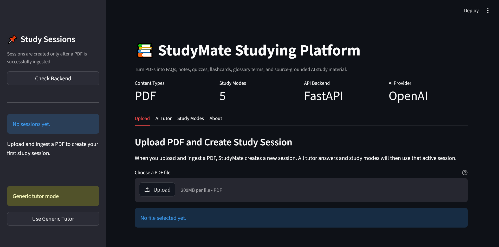
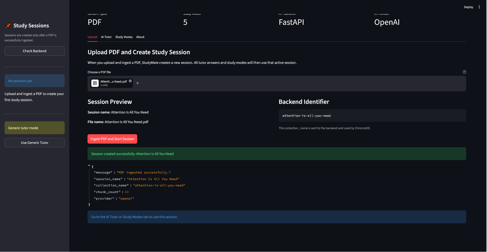
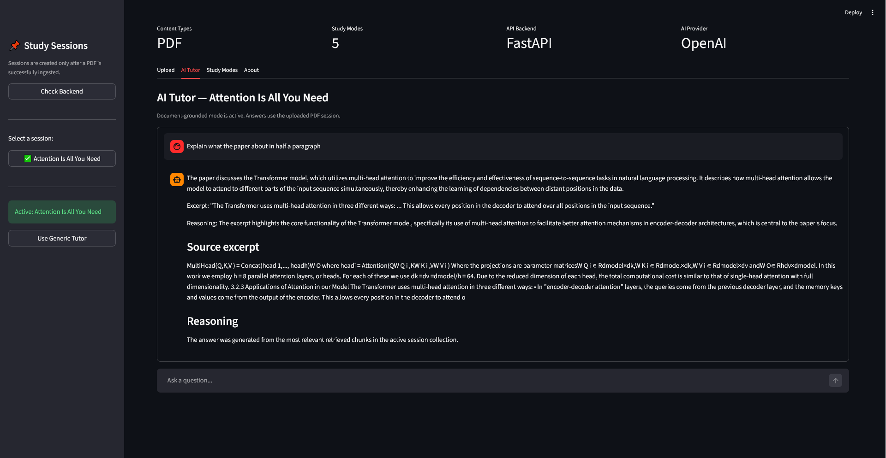
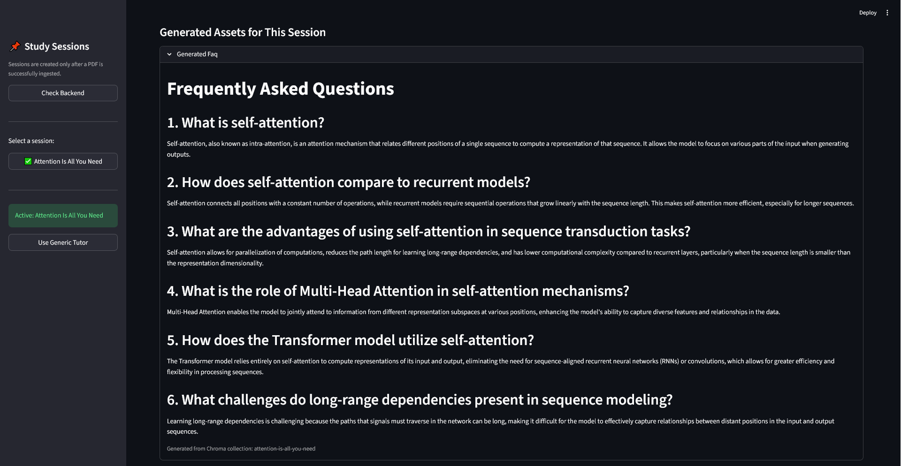

# StudyMate 

StudyMate is a full-stack AI studying platform that turns uploaded PDF learning material into source-grounded tutoring support and structured study resources.

Users can upload a PDF, create a study session, ask questions about the uploaded material, and generate study assets such as FAQs, notes, quizzes, flashcards, and glossary terms.

The project demonstrates a practical AI application using **Streamlit**, **FastAPI**, **OpenAI**, **ChromaDB**, and **SQLite**.

---

## Screenshots
- Landing dashboard

- Upload and ingestion flow

- AI Tutor with citations

- Generated FAQs


## Project Overview

StudyMate helps learners upload course materials and instantly generates interactive study resources.

## Features
- PDF and URL ingestion
- RAG-based AI tutor
- Source-grounded answers
- Generated FAQs, notes, quizzes, flashcards, and glossary terms
- Session history and metadata persistence
- REST API for content syndication
- Docker-ready deployment


# StudyMate — AI-Powered Studying Platform

StudyMate is a full-stack AI studying platform that turns uploaded PDFs into source-grounded learning material. Users can upload a PDF, create a study session, ask an AI tutor questions about the document, and generate study assets such as FAQs, notes, quizzes, flashcards, and glossary terms.

The app is designed as a portfolio project to demonstrate practical skills in:

* Python
* Streamlit
* FastAPI
* REST APIs
* OpenAI / ChatGPT integration
* Retrieval-Augmented Generation
* ChromaDB vector storage
* PDF ingestion
* Environment variables
* Session-based app design
* Database-backed metadata
* Docker-ready architecture

---

## 1. Project Overview

StudyMate is built around the idea of **study sessions**.

When the app first starts, there are no study sessions. In this state, users can only access:

* the generic AI tutor
* the upload page
* the about page

The generic tutor answers general questions using OpenAI, but it does not use uploaded course material.

Once a PDF is uploaded and successfully ingested, StudyMate creates a new study session. That session is connected to a ChromaDB vector collection. After that, all document-based features become available for the active session.

The document-based features include:

* source-grounded tutor chat
* FAQ generation
* notes generation
* quiz generation
* flashcard generation
* glossary generation

---

## 2. High-Level Architecture

```text
Streamlit Frontend
        ↓
FastAPI Backend
        ↓
OpenAI Chat Model + OpenAI Embeddings
        ↓
ChromaDB Vector Database
        ↓
SQLite Metadata Database
```

### Frontend

The frontend is built with Streamlit. It handles:

* displaying the app interface
* showing the session panel
* uploading PDFs
* calling backend API endpoints
* displaying chat history
* showing generated study assets

The frontend does **not** call OpenAI directly.

### Backend

The backend is built with FastAPI. It handles:

* receiving uploaded PDFs
* loading PDF text
* chunking documents
* creating OpenAI embeddings
* storing chunks in ChromaDB
* querying documents with RAG
* generating study assets
* managing session metadata

### OpenAI

OpenAI is used for:

* the generic AI tutor
* document-grounded tutor answers
* study asset generation
* embeddings for document chunks

The OpenAI API key is stored in the `.env` file and loaded by the backend only.

### ChromaDB

ChromaDB stores embedded document chunks. Each uploaded PDF session is connected to a Chroma collection using a `collection_name`.

### SQLite

SQLite stores basic metadata such as learning sessions and document records.

---

## 3. Folder Structure

A clean project structure should look similar to this:

```text
StudyMate/
├── app/
│   └── streamlit_app.py
│
├── backend/
│   ├── api.py
│   ├── schemas.py
│   ├── settings.py
│   └── services/
│       ├── generation_service.py
│       ├── metadata_service.py
│       └── rag_service.py
│
├── core/
│   ├── document_loader.py
│   └── prompts.py
│
├── data/
│   ├── uploads/
│   └── pdfs/
│
├── db/
│   ├── chroma/
│   └── studystore.db
│
├── .env
├── .env.example
├── .gitignore
├── requirements.txt
└── README.md
```

---

## 4. File Responsibilities

### `app/streamlit_app.py`

This is the frontend of the project.

It is responsible for:

* rendering the StudyMate interface
* managing Streamlit session state
* showing the session sidebar
* uploading PDF files
* calling the FastAPI backend
* displaying generic tutor responses
* displaying document-grounded tutor responses
* disabling study modes until a PDF has been successfully ingested
* storing chat history for each session
* storing generated study assets for each session

The Streamlit app only needs the backend URL:

```bash
API_BASE_URL=http://127.0.0.1:8000
```

It should not use:

```bash
OPENAI_API_KEY
```

The OpenAI key belongs in the backend.

---

### `backend/api.py`

This is the main FastAPI backend file.

It defines the API routes used by the Streamlit frontend.

Expected routes:

```text
GET  /api/health
POST /api/sessions
GET  /api/sessions
POST /api/ingest/pdf
POST /api/query/basic
POST /api/query
POST /api/generate/{mode}
```

Main responsibilities:

* start the backend app
* initialize required folders
* initialize the SQLite database
* receive PDF uploads
* create Chroma collections
* handle generic tutor questions
* handle document-grounded tutor questions
* generate study assets

---

### `backend/settings.py`

This file loads environment variables from `.env`.

It stores configuration such as:

```bash
OPENAI_API_KEY
OPENAI_CHAT_MODEL
OPENAI_EMBEDDING_MODEL
CHROMA_DB_DIR
```

This keeps sensitive information and configuration outside the main application logic.

---

### `backend/schemas.py`

This file contains shared data models.

Main models:

```python
LearningSession
DocumentRecord
QueryRequest
QueryResponse
```

These models help standardize request and response formats across the backend.

---

### `backend/services/rag_service.py`

This is the main RAG service file.

It handles:

* cleaning collection names
* loading uploaded PDFs
* splitting documents into chunks
* creating OpenAI embeddings
* creating Chroma vector stores
* loading Chroma vector stores
* querying documents
* running the generic tutor
* formatting retrieved context

This is the main file that connects:

```text
PDF → chunks → OpenAI embeddings → ChromaDB → retrieval → ChatGPT answer
```

---

### `backend/services/generation_service.py`

This file generates study assets for an active session.

Supported modes:

```text
faq
notes
quiz
flashcards
glossary
```

It loads the active session’s Chroma collection, retrieves useful chunks, sends them to OpenAI, and returns generated markdown content.

It also includes a mock fallback so the app does not completely fail during demos if OpenAI is temporarily unavailable.

---

### `backend/services/metadata_service.py`

This file handles SQLite database operations.

It can:

* initialize the database
* create learning sessions
* list learning sessions
* add document records

This gives the project a database layer beyond just vector search.

---

### `core/document_loader.py`

This file contains optional reusable document-loading utilities.

It can be used for:

* reading URLs from a file
* saving URLs as PDFs using Selenium
* loading PDFs from a folder
* loading a single PDF from disk

This file is useful if you later expand the project to support URL ingestion.

---

### `core/prompts.py`

This file stores reusable prompts.

It can contain prompts such as:

* RAG prompt
* FAQ generation prompt
* quiz generation prompt
* glossary prompt

Keeping prompts here makes the project easier to maintain.

---

## 5. Environment Setup

### Step 1: Create a virtual environment

From the project root, run:

```bash
python -m venv .venv
```

Activate it.

On Windows PowerShell:

```powershell
.venv\Scripts\Activate
```

On macOS/Linux:

```bash
source .venv/bin/activate
```

---

### Step 2: Install dependencies

```bash
pip install -r requirements.txt
```

A basic `requirements.txt` should include:

```txt
fastapi
uvicorn[standard]
python-dotenv
python-multipart
streamlit
requests
sqlmodel
langchain
langchain-community
langchain-openai
langchain-chroma
langchain-text-splitters
chromadb
pypdf
pydantic
selenium
```

If the project is fully OpenAI-based, you do not need:

```txt
langchain-ollama
```

unless you intentionally keep old Ollama support.

---

## 6. Environment Variables

Create a `.env` file in the project root.

Example:

```bash
OPENAI_API_KEY=your_real_openai_api_key_here
OPENAI_CHAT_MODEL=gpt-4o-mini
OPENAI_EMBEDDING_MODEL=text-embedding-3-small
CHROMA_DB_DIR=./db/chroma
API_BASE_URL=http://127.0.0.1:8000
```

### Important

Never commit your real `.env` file to GitHub.

Add this to `.gitignore`:

```bash
.env
.venv/
__pycache__/
*.pyc
db/
data/uploads/
```

---

## 7. `.env.example`

Create a safe template file called `.env.example`.

```bash
# OpenAI configuration
OPENAI_API_KEY=your_openai_api_key_here
OPENAI_CHAT_MODEL=gpt-4o-mini
OPENAI_EMBEDDING_MODEL=text-embedding-3-small

# Chroma database path
CHROMA_DB_DIR=./db/chroma

# Streamlit frontend to backend connection
API_BASE_URL=http://127.0.0.1:8000
```

This file can be committed to GitHub because it does not contain real secrets.

---

## 8. Running the Project Locally

You need two terminals:

1. one for the FastAPI backend
2. one for the Streamlit frontend

---

### Terminal 1: Start FastAPI backend

From the project root:

```bash
uvicorn backend.api:app --reload
```

Expected output:

```text
Uvicorn running on http://127.0.0.1:8000
```

You can test the backend by opening:

```text
http://127.0.0.1:8000/docs
```

This opens the FastAPI interactive documentation.

---

### Terminal 2: Start Streamlit frontend

From the project root:

```bash
streamlit run app/streamlit_app.py
```

Expected output:

```text
Local URL: http://localhost:8501
```

Open the Streamlit URL in your browser.

---

## 9. App Walkthrough

### Step 1: First app launch

When you first open StudyMate:

* no sessions exist
* the sidebar shows no study sessions
* the app is in generic tutor mode
* study modes are disabled
* upload is available
* about page is available

This is expected behavior.

---

### Step 2: Use the generic AI tutor

Go to the **AI Tutor** tab.

Ask a general question such as:

```text
Explain what an API is in simple terms.
```

Because no PDF has been uploaded yet, StudyMate calls:

```text
POST /api/query/basic
```

This uses OpenAI without document context.

Expected response:

```json
{
  "answer": "...",
  "mode": "basic",
  "source_excerpt": null,
  "reasoning": "Generic tutor response generated without document context."
}
```

---

### Step 3: Upload a PDF

Go to the **Upload** tab.

Choose a PDF file.

The app previews:

```text
Session name
Backend collection name
File name
```

Example:

```text
File: python-basics.pdf
Session name: Python Basics
Collection name: python-basics
```

Click:

```text
Ingest PDF and Start Session
```

The frontend sends the file to:

```text
POST /api/ingest/pdf
```

The backend then:

1. receives the uploaded file
2. loads the PDF pages
3. splits pages into chunks
4. creates OpenAI embeddings
5. stores vectors in ChromaDB
6. returns the collection name and chunk count

Expected response:

```json
{
  "message": "PDF ingested successfully.",
  "session_name": "Python Basics",
  "collection_name": "python-basics",
  "chunk_count": 12,
  "provider": "openai"
}
```

After this succeeds, StudyMate creates a new active session.

---

### Step 4: Use document-grounded tutor mode

Go back to the **AI Tutor** tab.

Ask a question about the uploaded PDF:

```text
What are the main ideas in this document?
```

Because a session is active, StudyMate calls:

```text
POST /api/query
```

The request body looks like:

```json
{
  "collection_name": "python-basics",
  "question": "What are the main ideas in this document?"
}
```

The backend:

1. loads the Chroma collection
2. retrieves relevant chunks
3. sends the chunks and question to OpenAI
4. returns an answer, source excerpt, and reasoning

Expected response:

```json
{
  "answer": "...",
  "source_excerpt": "...",
  "reasoning": "..."
}
```

---

### Step 5: Generate study assets

Go to the **Study Modes** tab.

Once a session exists, the study mode controls become enabled.

Choose a mode:

```text
faq
notes
quiz
flashcards
glossary
```

Click:

```text
Generate Study Asset
```

The frontend calls:

```text
POST /api/generate/{mode}
```

Example:

```text
POST /api/generate/faq
```

The backend receives:

```text
collection_name=python-basics
```

The backend:

1. loads the Chroma collection
2. retrieves important document chunks
3. sends the retrieved content to OpenAI
4. generates clean markdown
5. returns the generated asset

Expected response:

```json
{
  "mode": "faq",
  "title": "Generated Faq",
  "content_markdown": "...",
  "source_basis": "Generated from Chroma collection: python-basics"
}
```

The generated asset is stored inside the active Streamlit session.

---

## 10. API Endpoint Guide

### Health Check

```http
GET /api/health
```

Purpose:

Checks if the backend is running.

Example response:

```json
{
  "status": "ok",
  "service": "studymate",
  "provider": "openai"
}
```

---

### Generic Tutor

```http
POST /api/query/basic
```

Purpose:

Answers general questions when no document session is active.

Request:

```json
{
  "question": "Explain machine learning in simple terms."
}
```

Response:

```json
{
  "answer": "...",
  "mode": "basic",
  "source_excerpt": null,
  "reasoning": "Generic tutor response generated without document context."
}
```

---

### Ingest PDF

```http
POST /api/ingest/pdf
```

Purpose:

Uploads and processes a PDF.

Form fields:

```text
file=<uploaded pdf>
collection_name=python-basics
```

Response:

```json
{
  "message": "PDF ingested successfully.",
  "session_name": "Python Basics",
  "collection_name": "python-basics",
  "chunk_count": 12,
  "provider": "openai"
}
```

---

### Document Query

```http
POST /api/query
```

Purpose:

Asks a question using an uploaded PDF session.

Request:

```json
{
  "collection_name": "python-basics",
  "question": "What are variables?"
}
```

Response:

```json
{
  "answer": "...",
  "source_excerpt": "...",
  "reasoning": "..."
}
```

---

### Generate Study Asset

```http
POST /api/generate/{mode}
```

Supported modes:

```text
faq
notes
quiz
flashcards
glossary
```

Example:

```http
POST /api/generate/quiz
```

Form field:

```text
collection_name=python-basics
```

Response:

```json
{
  "mode": "quiz",
  "title": "Generated Quiz",
  "content_markdown": "...",
  "source_basis": "Generated from Chroma collection: python-basics"
}
```

---

## 11. Manual Testing with curl

### Test health endpoint

```bash
curl http://127.0.0.1:8000/api/health
```

---

### Test generic tutor

```bash
curl -X POST "http://127.0.0.1:8000/api/query/basic" \
-H "Content-Type: application/json" \
-d "{\"question\":\"Explain what APIs are in simple terms.\"}"
```

PowerShell:

```powershell
curl.exe -X POST "http://127.0.0.1:8000/api/query/basic" `
-H "Content-Type: application/json" `
-d "{\"question\":\"Explain what APIs are in simple terms.\"}"
```

---

### Test PDF ingestion

```bash
curl -X POST "http://127.0.0.1:8000/api/ingest/pdf" \
-F "file=@data/pdfs/python-basics.pdf" \
-F "collection_name=python-basics"
```

PowerShell:

```powershell
curl.exe -X POST "http://127.0.0.1:8000/api/ingest/pdf" `
-F "file=@data/pdfs/python-basics.pdf" `
-F "collection_name=python-basics"
```

---

### Test document query

```bash
curl -X POST "http://127.0.0.1:8000/api/query" \
-H "Content-Type: application/json" \
-d "{\"collection_name\":\"python-basics\",\"question\":\"What are the main ideas in this document?\"}"
```

PowerShell:

```powershell
curl.exe -X POST "http://127.0.0.1:8000/api/query" `
-H "Content-Type: application/json" `
-d "{\"collection_name\":\"python-basics\",\"question\":\"What are the main ideas in this document?\"}"
```

---

### Test FAQ generation

```bash
curl -X POST "http://127.0.0.1:8000/api/generate/faq" \
-F "collection_name=python-basics"
```

PowerShell:

```powershell
curl.exe -X POST "http://127.0.0.1:8000/api/generate/faq" `
-F "collection_name=python-basics"
```

---

## 12. Full Testing Checklist

### Backend checklist

```text
[ ] FastAPI starts without errors
[ ] /api/health returns 200
[ ] /api/query/basic works with OpenAI
[ ] /api/ingest/pdf successfully processes a PDF
[ ] ChromaDB files are created
[ ] /api/query returns source-grounded answers
[ ] /api/generate/faq works
[ ] /api/generate/notes works
[ ] /api/generate/quiz works
[ ] /api/generate/flashcards works
[ ] /api/generate/glossary works
```

### Frontend checklist

```text
[ ] Streamlit starts without errors
[ ] No sessions show on first launch
[ ] Generic AI tutor works before upload
[ ] Study modes are disabled before upload
[ ] PDF upload creates a session
[ ] Sidebar shows the active session
[ ] Document tutor uses the active session
[ ] Generated assets stay tied to the active session
[ ] Generic tutor history and session tutor history are separate
```

### OpenAI checklist

```text
[ ] OPENAI_API_KEY exists in .env
[ ] API key is not hardcoded in any file
[ ] Streamlit does not load the OpenAI key
[ ] Backend loads the OpenAI key from settings.py
[ ] OpenAI embeddings are used for ingestion
[ ] ChatOpenAI is used for tutor and generation
```

---

## 13. Common Errors and Fixes

### Error: `/api/health` returns 404

Cause:

The backend does not have the route.

Fix:

Make sure `backend/api.py` includes:

```python
@app.get("/api/health")
def health():
    return {
        "status": "ok",
        "service": "studymate",
        "provider": "openai"
    }
```

---

### Error: OpenAI API key missing

Cause:

`.env` does not contain a valid key or the backend did not load it.

Fix:

Check `.env`:

```bash
OPENAI_API_KEY=your_real_key_here
```

Restart FastAPI after editing `.env`.

---

### Error: Study modes show mock content

Cause:

The real generation failed and fallback was triggered.

Fix:

Check the FastAPI terminal for errors. Confirm:

```text
OPENAI_API_KEY is valid
collection_name exists
PDF was successfully ingested
ChromaDB was created
```

---

### Error: Document query gives empty or unrelated answers

Cause:

The PDF may not have been ingested correctly, or the wrong collection name is being used.

Fix:

Re-ingest the PDF and confirm the returned `collection_name`.

---

### Error: Old Ollama message appears

Cause:

Old Ollama code is still being imported.

Fix:

Search the project for:

```text
ChatOllama
OllamaEmbeddings
langchain_ollama
```

If the final project is OpenAI-based, these should not be used in live backend files.

---

## 14. Notes on Legacy Files

Earlier versions of this project used Ollama.

The final OpenAI version should avoid importing old Ollama-based files such as:

```text
core/rag.py
core/vectorstore.py
```

If you want to keep them for reference, move them into:

```text
legacy_ollama/
```

The active OpenAI app should use:

```text
backend/services/rag_service.py
backend/services/generation_service.py
```

---

## 15. Future Improvements

Potential improvements include:

* Dockerfile
* docker-compose.yml
* persistent session loading in Streamlit from SQLite
* user authentication
* URL ingestion from web pages
* YouTube/video transcript ingestion
* image/slide ingestion
* downloadable generated study assets
* automated tests with pytest
* deployment to a cloud platform
* Kubernetes deployment files

---

## 16. Final Demo Flow

A strong project demo should follow this order:

1. Start FastAPI backend.
2. Start Streamlit frontend.
3. Show that no sessions exist at launch.
4. Ask a generic tutor question.
5. Upload a PDF.
6. Ingest the PDF.
7. Show the new session in the sidebar.
8. Ask a document-specific question.
9. Show the answer, source excerpt, and reasoning.
10. Generate FAQ.
11. Generate quiz.
12. Explain that the frontend does not store the OpenAI key.
13. Explain that the backend uses OpenAI embeddings and ChatOpenAI.
14. Explain that ChromaDB stores document vectors.
15. Explain that containerization is the next planned step.

---

## 17. Project Summary

StudyMate demonstrates how a modern AI learning application can be built using a clean frontend/backend architecture.

The key workflow is:

```text
PDF Upload
    ↓
PDF Loading
    ↓
Text Chunking
    ↓
OpenAI Embeddings
    ↓
ChromaDB Storage
    ↓
Source-Grounded Retrieval
    ↓
ChatGPT Answer or Generated Study Asset
```

This makes StudyMate more than a chatbot. It is a session-based learning platform that uses retrieval-augmented generation to help learners study from their own uploaded materials.
